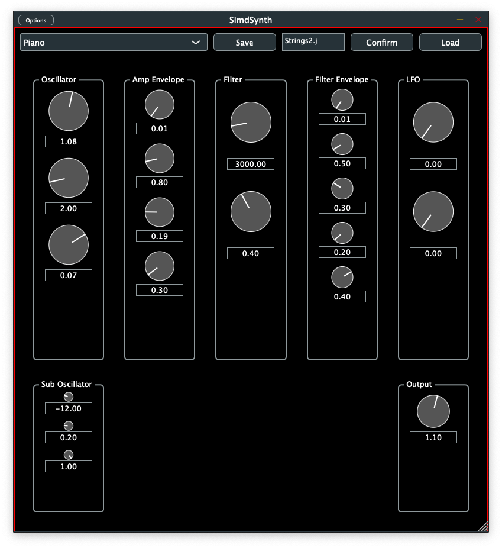

# SIMDsynth

This is a SIMD-accelerated audio synthesizer written in C++ with the JUCE framework, using vectorized math to simulate polyphonic audio synthesis with filters, envelopes, LFOs, and sine and saw wavetable oscillators. 

It's optimized for both x86-64 (SSE) and ARM64 (NEON) platforms, in order to highlight the SIMD techniques in a JUCE context.

Some rudimentary factory presets are included in the plugin - they will be created automatically on first execution of the plugin.

## High-Level Overview
- Multiple synthesis formats (AU, VST3, Standalone)
- Up to 8-voice polyphony
- Multiple waveforms (sine, saw, square) using wavetables
- Sub-oscillator with keyboard tracking
- Unison feature with detune
- ADSR envelopes
- LFO modulation
- Filter per voice
- 4x oversampling to reduce aliasing
- Preset management system
- Includes a basic set of Factory Presets for testing purposes.

## Technical Implementation:
- Built using the JUCE framework
- Uses SIMD (Single Instruction Multiple Data) optimization for efficient processing
- Supports both x86 (SSE/SSE2/SSE4.1) and ARM (NEON) architectures
- Implements wavetable synthesis with 2048-point tables
- Uses modern C++17 features

(c) 2025, seclorum
